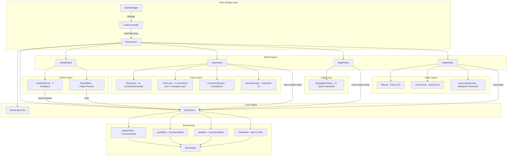

# Tonnetz Audio Pipeline Analysis and Optimization Plan

---

## Part 1: Current Architecture Visualization

### Signal Flow Diagram




### Node Count Audit (Estimated Total)


| Category              | Nodes                                                                             | Heavy Nodes                       |
| --------------------- | --------------------------------------------------------------------------------- | --------------------------------- |
| **BusSystem**         | 3 Reverbs + 1 Gain + 1 Limiter                                                    | 3x ConvolverNode                  |
| **AmbientDrone**      | 4 Oscillators + 4 Panner3D + 4 Gains + 1 Saturator(Worklet) + 1 Limiter + 3 Gains | 4x Panner3D                       |
| **WaveEffect**        | 1 Player + 1 Filter + 1 Gain + 1 Reverb + 1 Panner3D(HRTF) + 1 Gain               | 1x ConvolverNode + 1x HRTF Panner |
| **FacePlayer**        | 2 Vibrato + 6 Gains + master                                                      | 2x Vibrato (internal delay+osc)   |
| **BaseLayer**         | 3x OrchestraEnsemble (6 Samplers) + 3 Gains + 1 Panner3D + 1 Gain                 | 1x Panner3D, 6x Sampler           |
| **HornLayer**         | 4x (2 Samplers + 1 Panner3D + 1 Gain) = 16 nodes                                  | 4x Panner3D, 8x Sampler           |
| **CenterSynthLayer**  | 1 PolySynth(8) + 1 Filter + gains                                                 | 8 internal voices                 |
| **AstralArpLayer**    | 1 PolySynth(12) + 1 Filter + 1 Delay + gains                                      | 12 internal voices                |
| **ArpeggiatorPlayer** | 7x (Synth + Panner3D + Gain) + 7 Sequences + Filter + Delay + Limiter + gains     | 7x Panner3D                       |
| **Effector**          | 1 Filter + 1 LFO + 1 Volume + 2 Gains                                             | -                                 |
| **CentorTone**        | 1 PolySynth(6) + 1 Filter + 1 NoiseSynth                                          | 6 internal voices                 |
| **SurroundingTones**  | 1 FMSynth + 1 Panner3D + 1 Gain + 1 Loop                                          | 1x Panner3D                       |


**Total estimated:** ~100+ active AudioNodes, of which:

- **4x ConvolverNode** (3 buses + 1 WaveEffect local) -- MOST expensive
- **~18x Panner3D** (mostly equalpower, 1 HRTF) -- 2nd most expensive
- **~14x Sampler** (buffer-based, moderate)
- **~26+ oscillator/synth voices** across PolySynths

---

## Part 2: Comparison with Web Audio Best Practices

### A. Reference Architecture Patterns (from research)

Industry-standard web audio projects with efficient resource management share these traits:

1. **Single AudioContext, Minimal ConvolverNode Usage**
  - Best practice: Use a maximum of 1-2 shared ConvolverNode instances via a bus architecture. Each additional ConvolverNode incurs FFT-based convolution cost.
  - **Your project: 4 ConvolverNodes** (3 bus reverbs + 1 local in WaveEffect). The WaveEffect has its own `Tone.Reverb` instance separate from the bus system, which is redundant and expensive.
2. **HRTF Panning Reserved for Critical Sources Only**
  - Best practice: Default to `equalpower`, use HRTF only where spatial realism is essential (1-2 sources max).
  - **Your project: Correctly defaults to equalpower.** Only WaveEffect uses HRTF. This is good, but the sheer count of Panner3D nodes (~18) is still significant.
3. **Transport-Synced Scheduling, Never setInterval**
  - Best practice: All audio timing should use the audio clock (Transport/AudioContext.currentTime). JavaScript timers (setInterval, setTimeout) are unreliable, get throttled in background tabs, and cause timing drift.
  - **Your project: FacePlayer uses `setInterval` for re-trigger loop** ([FacePlayer.ts](app/lib/audio/player/FacePlayer.ts) line 149). This is a critical anti-pattern that can cause audible timing jitter and contributes to buffering issues.
4. **Lazy Initialization / On-Demand Node Creation**
  - Best practice: Only create nodes when a mode is active. Dispose or disconnect them when inactive.
  - **Your project: All 4 mode players are instantiated immediately** in the Orchestrator constructor, regardless of which mode is active. This means ~100 nodes are active from startup, even though only one mode plays at a time.
5. **Node Pooling and Recycling**
  - Best practice: Pre-allocate a fixed pool and recycle rather than create/destroy.
  - **Your project: Partial implementation.** HornLayer has a voice pool (good). ArpeggiatorPlayer pre-creates 7 voices (good). But BaseLayer creates 3 full OrchestraEnsembles for triple buffering (heavy).
6. **AudioWorklet for Custom DSP**
  - Best practice: Move expensive per-sample processing to AudioWorklet to avoid main thread blocking.
  - **Your project: Good.** HarmonicSaturator correctly uses AudioWorklet. However, only one effect uses it; other candidate processes (like a custom lightweight reverb) could also benefit.
7. **Context LatencyHint Configuration**
  - Best practice: Set `latencyHint` BEFORE creating the AudioContext, not after.
  - **Your project: Sets `latencyHint` AFTER context creation** in AudioManager.tsx line 41-42. This may not take effect because the latencyHint is used at construction time.

### B. Summary Comparison Table


| Practice            | Industry Standard       | Your Implementation               | Gap    |
| ------------------- | ----------------------- | --------------------------------- | ------ |
| ConvolverNode count | 1-2 shared              | 4 (3 bus + 1 local)               | HIGH   |
| HRTF usage          | 0-2 sources             | 1 source (WaveEffect)             | OK     |
| Panner3D count      | Minimize                | ~18 instances                     | MEDIUM |
| Scheduling          | Transport/AudioClock    | Mixed (setInterval in FacePlayer) | HIGH   |
| Node lifecycle      | Lazy/on-demand          | All eager at startup              | HIGH   |
| Voice pooling       | Consistent pools        | Partial (some layers)             | MEDIUM |
| latencyHint timing  | Before context creation | After context creation            | HIGH   |
| lookAhead tuning    | Balanced for use case   | 0.3s (very conservative)          | MEDIUM |
| Inactive mode nodes | Disconnected            | Always connected                  | HIGH   |


---

## Part 3: Identified Problems and Root Causes of Buffering/Latency

### Critical Issues

1. **Excessive ConvolverNode load (4 instances)**
  - Each ConvolverNode performs FFT-based convolution on every audio frame. With 4 instances running simultaneously, this is the single biggest CPU drain. The WaveEffect's local reverb is redundant -- it should route through the bus system.
2. **All modes active simultaneously**
  - The Orchestrator eagerly creates and connects ALL players at startup. Even when in "node" mode, the Face/Edge players' internal nodes (PolySynths, Samplers, Sequences, Panners) are still alive and connected to the audio graph, consuming processing time even if their gain is 0. Web Audio spec says: connected nodes with zero gain still process audio.
3. **setInterval for audio scheduling (FacePlayer)**
  - `setInterval(() => { ... }, 200)` at line 149 of FacePlayer.ts is a JavaScript timer on the main thread. It creates timing jitter, gets throttled when tabs are backgrounded, and competes with the render loop for CPU time. This directly contributes to perceived buffering.
4. **latencyHint set after context creation**
  - In AudioManager.tsx, `latencyHint` is set after `Tone.start()`. The Web Audio API only uses latencyHint at AudioContext construction time. Your setting is likely being ignored, meaning the context runs with default `"interactive"` hint which uses smaller buffers and is more prone to underruns (crackling/glitches) under heavy load.
5. **lookAhead of 0.3s is excessively conservative**
  - A 300ms lookahead adds 300ms of perceived latency to every audio event. Industry standard is 0.05-0.1s. While higher values give the audio thread more breathing room, 0.3s is overkill and makes the audio feel sluggish.
6. **Triple-buffered OrchestraEnsemble (BaseLayer)**
  - Creating 3 complete OrchestraEnsembles (6 Samplers total) for crossfading is memory-heavy. Two would suffice for seamless transitions (double buffering).
7. **Multiple setTimeout for deferred cleanup**
  - Throughout the codebase (FacePlayer, EdgePlayer, NodePlayer, HornLayer, BaseLayer), `setTimeout` is used for delayed operations like stopping players after fades. These are unreliable and can cause dangling references or premature disposal.

### Secondary Issues

1. **Panner3D proliferation** -- 18 Panner3D instances is heavy. Many could be replaced with simple `StereoPannerNode` or removed entirely for non-spatial layers.
2. **No node disconnection for inactive modes** -- Even at gain=0, connected nodes process audio buffers. Disconnecting inactive branches from the graph would eliminate their CPU cost entirely.
3. **Reverb `generate()` called synchronously** -- `Tone.Reverb` generates its impulse response buffer asynchronously. If not awaited, early audio may play without reverb or cause a scheduling hiccup.
4. **Frame-rate coupled audio updates** -- `useFrame` drives `Orchestrator.update()` at display refresh rate (60-144fps), but audio state changes are much less frequent. This causes unnecessary processing overhead.

---

## Part 4: Optimization Plan

### Phase 1: Critical Fixes (Immediate Impact on Buffering)

**1.1 Fix AudioContext latencyHint initialization**

- File: [AudioManager.tsx](app/components/walkthrough/shared/audio/AudioManager.tsx)
- Create a new AudioContext with the correct latencyHint BEFORE calling `Tone.start()`:

```typescript
const ctx = new AudioContext({ latencyHint: 'playback', sampleRate: 44100 });
Tone.setContext(new Tone.Context(ctx));
await Tone.start();
```

- Reasoning: This is the single simplest fix with highest impact. `'playback'` mode uses larger internal buffers (typically 2048+ samples vs 256 for 'interactive'), dramatically reducing the chance of buffer underruns that cause crackling and audio drops.

**1.2 Eliminate WaveEffect local reverb**

- File: [WaveEffect.ts](app/lib/audio/global/WaveEffect.ts)
- Remove the `this.reverb = new Tone.Reverb(...)` instance. Instead, route the WaveEffect through the existing bus system by exposing a send port (e.g., `deep` or `ambient`).
- This reduces ConvolverNode count from 4 to 3 (25% reduction in the most expensive node type).

**1.3 Replace setInterval with Tone.Loop in FacePlayer**

- File: [FacePlayer.ts](app/lib/audio/player/FacePlayer.ts)
- Replace the `setInterval`-based re-trigger loop with a `Tone.Loop` synced to Transport:

```typescript
private reTriggerLoop: Tone.Loop;

// In constructor:
this.reTriggerLoop = new Tone.Loop((time) => {
    if (this.isAudible && this.currentNotes.length > 0) {
        this.baseLayer.trigger(this.currentNotes, true, time);
        this.hornLayer.sustainLoop(time);
    }
}, '4n'); // ~200ms at 120 BPM, or use seconds: 0.2

// Start/stop with mode
startLoop() { this.reTriggerLoop.start(); }
stopLoop()  { this.reTriggerLoop.stop(); }
```

- Reasoning: Transport-synced loops use the high-precision audio clock, never get throttled in background tabs, and schedule with proper lookahead.

**1.4 Reduce lookAhead to 0.1s**

- File: [AudioConfig.ts](app/lib/audio/core/AudioConfig.ts)
- Change `lookAhead: 0.3` to `lookAhead: 0.1`.
- Reasoning: 100ms is the Tone.js default and provides good balance. Combined with the `'playback'` latencyHint, this gives enough scheduling headroom without the 300ms perceived delay.

---

### Phase 2: Lazy Initialization and Node Lifecycle Management

**2.1 Implement lazy player activation**

- File: [Orchestrator.ts](app/lib/audio/core/Orchestrator.ts)
- Instead of creating all players in the constructor, create them on-demand when a mode is entered, and disconnect (not dispose) when exiting:

```typescript
private playerInstances: Map<string, MatrixPlayer> = new Map();

private getOrCreatePlayer(mode: string): MatrixPlayer {
    if (!this.playerInstances.has(mode)) {
        const player = this.createPlayer(mode);
        this.busSystem.connectPlayer(player);
        this.playerInstances.set(mode, player);
    }
    return this.playerInstances.get(mode)!;
}
```

- On mode exit: Disconnect the player's ports from the bus system (but keep the instance alive for fast re-entry). This ensures only the active mode's nodes are in the audio graph.
- Reasoning: Connected nodes at gain=0 still consume CPU. Disconnecting removes them from the graph entirely. This can reduce active node count by 60-75% at any given time.

**2.2 Add disconnect/reconnect to BusSystem**

- File: [Buses.ts](app/lib/audio/core/Buses.ts)
- Add `disconnectPlayer(player)` method that calls `disconnect()` on all ports.
- Reasoning: Enables Phase 2.1 to actually remove inactive nodes from the processing graph.

**2.3 GlobalPlayer always-on, mode players on-demand**

- GlobalPlayer (AmbientDrone + WaveEffect) stays connected always as it plays across all modes.
- FacePlayer, EdgePlayer, NodePlayer connect/disconnect based on active mode.

---

### Phase 3: Node Count Reduction

**3.1 Reduce BaseLayer from triple to double buffering**

- File: [StringsLayer.ts](app/lib/audio/face/layers/StringsLayer.ts)
- Change from 3 OrchestraEnsembles to 2. Double buffering is sufficient for seamless crossfading and saves 2 Sampler instances.

**3.2 Reduce Panner3D usage for non-critical layers**

- For layers where spatial positioning is subtle or unnecessary (e.g., CenterSynthLayer, AstralArpLayer), remove Panner3D and use simple `Tone.Panner` (StereoPannerNode) or direct routing.
- Estimated savings: 4-6 Panner3D instances removed.

**3.3 Consider reducing ArpeggiatorPlayer voice count**

- 7 voices with individual Panner3D each is expensive. Consider reducing to 4-5, or sharing panners between nearby voices.

---

### Phase 4: Scheduling and Timer Cleanup

**4.1 Replace all setTimeout-based cleanups with Transport-synced scheduling**

- Files: FacePlayer.ts, EdgePlayer.ts, NodePlayer.ts, HornLayer.ts, BaseLayer.ts
- Use `Tone.getTransport().scheduleOnce()` instead of `setTimeout()` for deferred audio operations:

```typescript
// Instead of:
setTimeout(() => { this.stop(); }, rampTime * 1000 + 200);

// Use:
Tone.getTransport().scheduleOnce((time) => {
    this.stop();
}, `+${rampTime + 0.2}`);
```

- Reasoning: Keeps all timing on the audio clock. Prevents issues with browser timer throttling and ensures cleanup happens at the correct audio time.

**4.2 Throttle Orchestrator.update() to audio-rate**

- File: [AudioController.tsx](app/components/walkthrough/shared/audio/AudioController.tsx)
- The `useFrame` callback runs at display refresh rate (60-144 Hz). Audio state typically changes at much lower rates. Add throttling:

```typescript
const lastUpdateRef = useRef(0);
const AUDIO_UPDATE_INTERVAL = 1/30; // 30 Hz is sufficient for audio state

useFrame((_, delta) => {
    lastUpdateRef.current += delta;
    if (lastUpdateRef.current < AUDIO_UPDATE_INTERVAL) return;
    lastUpdateRef.current = 0;
    // ... update orchestrator
});
```

- Reasoning: Reduces CPU overhead from the JavaScript side of the audio update loop by 50-75%.

---

### Phase 5: Advanced Optimizations

**5.1 Reverb bus consolidation (3 to 2)**

- Evaluate whether `spatialBus` and `ambientBus` can be consolidated into a single reverb with different send levels. Going from 3 to 2 ConvolverNodes saves significant CPU.

**5.2 AudioWorklet-based lightweight reverb**

- For the remaining reverb needs, consider implementing a simple Schroeder or FDN (Feedback Delay Network) reverb as an AudioWorklet. This would replace one or more ConvolverNodes with a much lighter algorithmic approach.

**5.3 Sample rate reduction**

- If audio quality permits, running the AudioContext at 44100 Hz instead of the default 48000 Hz reduces processing cost by ~8%.

**5.4 Offline rendering for reverb IR generation**

- `Tone.Reverb.generate()` computes IR buffers. Pre-compute these and cache as static files to eliminate startup latency.

---

## Implementation Priority and Expected Impact


| Phase | Change                   | Effort  | Impact on Buffering |
| ----- | ------------------------ | ------- | ------------------- |
| 1.1   | Fix latencyHint          | Low     | VERY HIGH           |
| 1.2   | Remove WaveEffect reverb | Low     | HIGH                |
| 1.3   | Replace setInterval      | Medium  | HIGH                |
| 1.4   | Reduce lookAhead         | Trivial | MEDIUM              |
| 2.1   | Lazy player activation   | Medium  | VERY HIGH           |
| 2.2   | BusSystem disconnect     | Low     | HIGH (enables 2.1)  |
| 3.1   | Double buffer BaseLayer  | Low     | MEDIUM              |
| 3.2   | Reduce Panner3D count    | Medium  | MEDIUM              |
| 4.1   | Replace setTimeout       | Medium  | MEDIUM              |
| 4.2   | Throttle update loop     | Low     | MEDIUM              |
| 5.x   | Advanced optimizations   | High    | MEDIUM-HIGH         |


Phase 1 alone should resolve the majority of buffering and latency issues. Phase 2 provides the largest structural improvement. Phases 3-5 are progressive refinements.